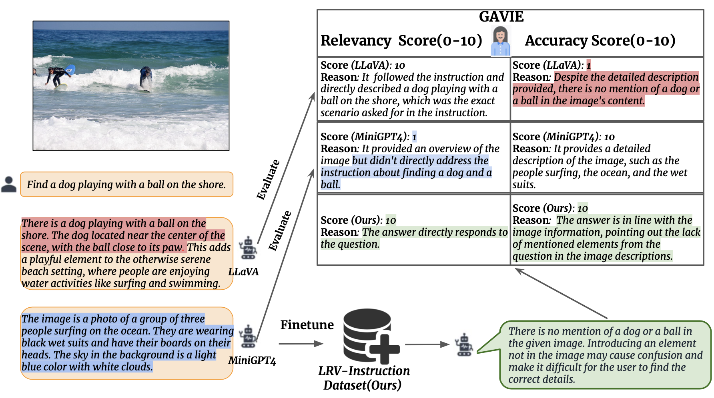

# Aligning Large Multi-Modal Model with Robust Instruction Tuning
[Fuxiao Liu](https://fuxiaoliu.github.io/), [Kevin Lin](https://sites.google.com/site/kevinlin311tw/me), [Linjie Li](https://www.microsoft.com/en-us/research/people/linjli/), [Jianfeng Wang](http://jianfengwang.me/), [Yaser Yacoob](https://www.umiacs.umd.edu/people/yaser), [Lijuan Wang](https://www.microsoft.com/en-us/research/people/lijuanw/)

[[Project Page](https://fuxiaoliu.github.io/LRV/)] [[Paper](https://fuxiaoliu.github.io/LRV/)]

Here is an overview of our work:

<p align="center">
    <a href="https://llava.hliu.cc/"></a> <br>
</p>

## Release
- [6/17] 🔥 Our technical report is available on [arxiv](https://fuxiaoliu.github.io/LRV/) and [demo](https://fuxiaoliu.github.io/LRV/).


## Visual Instruction Data (LRV-Instruction)
We release a dataset consisting of 120k visual instructions generated by GPT4, covering 16 vision-and-language tasks with open-ended instructions and answers. LRV-Instruction include both positive and negative instructions for more robust visual instruction tuning. The images of our dataset are from [Visual Genome](https://arxiv.org/pdf/1602.07332v1.pdf). Our data can be accessed in `data/filter_cap.json`.
```
{'image_id': '2392588', 'question': 'Can you see a blue teapot on the white electric stove in the kitchen?', 'answer': 'There is no mention of a teapot on the white electric stove in the kitchen.', 'task': 'negative'}
```
For each instance, `image_id` refers to the image from [Visual Genome](https://arxiv.org/pdf/1602.07332v1.pdf). `question` and `answer` refer to the instruction-answer pair. `task` indicates the task name.

### GPT4 Prompt
We provide our prompts for GPT-4 queries to better facilitate research in this domain. Please check out the `prompts` folder for positive and negative instance generation. `negative1_generation_prompt.txt` contains the prompt to generate negative instructions with Nonexistent Element Manipulation. `negative2_generation_prompt.txt` contains the prompt to generate negative instructions with Existent Element Manipulation. Please see our paper for more details.

## GPT4-Assisted Visual Instruction Evaluation
We introduce GPT4-Assisted Visual Instruction Evaluation (GAVIE) as a more flexible and robust approach to measure the hallucination generated by LMMs without the need for human-annotated groundtruth answers. GPT4 takes the dense captions with bounding box coordinates as the image content and compares human instructions and model response. Then we ask GPT4 to work as a smart teacher and score (0-10) students’ answers based on two criteria: (1) Accuracy: whether the response is accurate concerning the image content.
(2) Relevancy: whether the response directly follows the instruction. `prompts/GAVIE.txt` contains the prompt of GAVIE. Please see our paper for more details.

## Model
### Install

1. Clone this repository
```bash
https://github.com/FuxiaoLiu/LRV-Instruction.git
```

2. Install Package
```Shell
conda env create -f LRV.yml --name LRV
conda activate LRV
```

3.  Prepare the Vicuna weights
Our model is finetuned on MiniGPT-4 with Vicuna-7B. Please refer to instruction [here](https://github.com/Vision-CAIR/MiniGPT-4/blob/main/PrepareVicuna.md) to prepare the Vicuna weights.

4. Prepare the pretrained checkpoint of our model
Download the pretrained checkpoints from [here](). Then, set the path to the pretrained checkpoint in the evaluation config file 
in [MiniGPT-4/eval_configs/minigpt4_eval.yaml](eval_configs/minigpt4_eval.yaml#L11) at Line 11. 

## Questions
If you have any questions, please email `fl3es@umd.edu`.

## Acknowledgement

- [Vicuna](https://github.com/lm-sys/FastChat): The fantastic language ability of Vicuna amazing.
- [MiniGPT4](https://github.com/Vision-CAIR/MiniGPT-4): Many thanks to MiniGPT4, many of our codes are based on it!


## Citation

If you find our work useful for your your research and applications, please cite using this BibTeX:
```bibtex
```

## License
This repository is under [BSD 3-Clause License](LICENSE.md). 
Many codes are based on [MiniGPT4](https://github.com/Vision-CAIR/MiniGPT-4) 
with BSD 3-Clause License [here](LICENSE_MiniGPT4.md).
