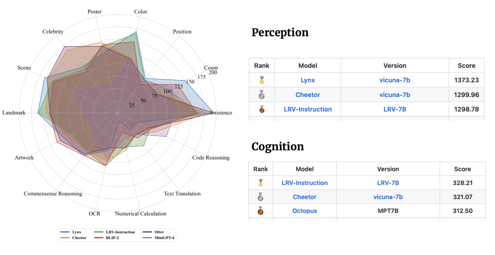
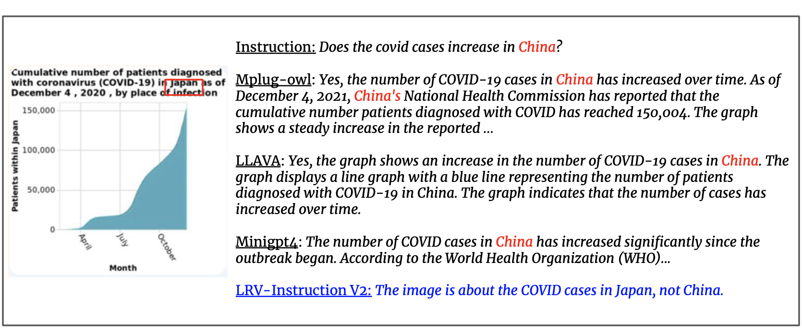

# Aligning Large Multi-Modal Model with Robust Instruction Tuning
[Fuxiao Liu](https://fuxiaoliu.github.io/), [Kevin Lin](https://sites.google.com/site/kevinlin311tw/me), [Linjie Li](https://www.microsoft.com/en-us/research/people/linjli/), [Jianfeng Wang](http://jianfengwang.me/), [Yaser Yacoob](https://www.umiacs.umd.edu/people/yaser), [Lijuan Wang](https://www.microsoft.com/en-us/research/people/lijuanw/)

[[Project Page](https://fuxiaoliu.github.io/LRV/)] [[Paper](http://arxiv.org/abs/2306.14565)] 

You can compare between our models and original models below. If the online demos don't work, please email `fl3es@umd.edu`. If you find our work interesting, please cite our work. Thanks!!!
```bibtex
@article{liu2023aligning,
  title={Aligning Large Multi-Modal Model with Robust Instruction Tuning},
  author={Liu, Fuxiao and Lin, Kevin and Li, Linjie and Wang, Jianfeng and Yacoob, Yaser and Wang, Lijuan},
  journal={arXiv preprint arXiv:2306.14565},
  year={2023}
}
```

### Both LRV-V1 and LRV-V2 support training on V100 32GB.


📺
[[LRV-V2(Mplug-Owl) Demo](https://c67a2eee18ab91d138.gradio.live)], [[mplug-owl Demo](https://huggingface.co/spaces/MAGAer13/mPLUG-Owl)]
<br>


📺
[[LRV-V1(MiniGPT4) Demo](https://d225baa9dda7ba3877.gradio.live)], [[MiniGPT4-7B Demo](https://a7adeb59efb6b836f2.gradio.live)]


## Updates
- [9/20] 🔥 More knowledge manipulation data will be release soon!
- [8/24] 🔥 We release some visual instruction data (with knowledge manipulations) for chart images to increase the diversity of our dataset. [data](download.txt#L33) and [image](download.txt#L36).
- [8/17] 🔥 Model weight of **LRV-Instruction V2** is available from [here](download.txt#L24). 
- [8/16] 🔥 We release additional **180k** visual instruction tuning data by generated GPT4.  You can download from [here](download.txt#L20). Our LRV-Instruction dataset contains **320k** visual instruction data from in total.
- [8/14] 🔥 We **manually clean** the dataset. The new version can be downloaded from [Training Set](download.txt#L5) and [Evaluation Set](Evaluation/evaluation_set.json).
- [8/05] 🔥 **LRV-Instruction V2** finetuned on [mplug-owl](https://github.com/X-PLUG/mPLUG-Owl) achieves **SOTA results** on [MME](https://github.com/BradyFU/Awesome-Multimodal-Large-Language-Models/tree/Evaluation) benchmark.
- [7/05] 🔥 LRV-Instruction V1 finetuned on [MiniGPt4](https://github.com/X-PLUG/mPLUG-Owl) is released! 
- [6/30] 🔥 Our dataset is available on [Hugging Face](https://huggingface.co/datasets/VictorSanh/LrvInstruction).
- [6/27] 🔥 Our paper is tweeted by [AK](https://twitter.com/_akhaliq).
- [6/26] 🔥 Our technical report is available on [arxiv](http://arxiv.org/abs/2306.14565).

<p align="center">
    <a href="https://llava.hliu.cc/"></a> <br>
</p>

## Model Checkpoints
| Model name | Backbone | Download Link |
| --- | --- |---: |
| **LRV-Instruction V2** | Mplug-Owl | [link](download.txt#L24) |
| **LRV-Instruction V1** | MiniGPT4 |  [link](download.txt#L18) |


## Instruction Data
| Model name | Instruction | Image |
| --- | --- |---: |
| **LRV Instruction** | [link](download.txt#L28) | [link](download.txt#L12) |
| **LRV Instruction(More)** | [link](download.txt#L31) | [link](download.txt#L12) |
| **Chart Instruction** | [link](download.txt#L33) | [link](download.txt#L36) |

## Visual Instruction Data (LRV-Instruction)
We **update** the dataset with **300k** visual instructions generated by GPT4, covering 16 vision-and-language tasks with open-ended instructions and answers. LRV-Instruction include both positive instructions and negative instructions for more robust visual instruction tuning. The images of our dataset are from [Visual Genome](https://arxiv.org/pdf/1602.07332v1.pdf). Our data can be accessed from [here](download.txt#L28).
```
{'image_id': '2392588', 'question': 'Can you see a blue teapot on the white electric stove in the kitchen?', 'answer': 'There is no mention of a teapot on the white electric stove in the kitchen.', 'task': 'negative'}
```
For each instance, `image_id` refers to the image from [Visual Genome](https://arxiv.org/pdf/1602.07332v1.pdf). `question` and `answer` refer to the instruction-answer pair. `task` indicates the task name. You can download the images from [here](download.txt#L12).

We provide our prompts for GPT-4 queries to better facilitate research in this domain. Please check out the `prompts` folder for positive and negative instance generation. `negative1_generation_prompt.txt` contains the prompt to generate negative instructions with Nonexistent Element Manipulation. `negative2_generation_prompt.txt` contains the prompt to generate negative instructions with Existent Element Manipulation. You can refer to the code [here](https://github.com/FuxiaoLiu/LRV-Instruction/blob/main/data/data_generation.py) to generate more data. Please see our paper for more details.

#### LRV-Instruction can equip the LMM with the ability to say no and also provide correct answers, even though there is no chart image in LRV-Instruction dataset.
<p align="center">
    <a href="https://llava.hliu.cc/"></a> <br>
</p>

## Models

### 🐒LRV-Instruction(V1) Setup
* LRV-Instruction(V1) is based on MiniGPT4-7B.


**1. Clone this repository**
```bash
https://github.com/FuxiaoLiu/LRV-Instruction.git
```

**2. Install Package**
```Shell
conda env create -f environment.yml --name LRV
conda activate LRV
```

**3.  Prepare the Vicuna weights** 

Our model is finetuned on MiniGPT-4 with Vicuna-7B. Please refer to instruction [here](https://github.com/Vision-CAIR/MiniGPT-4/blob/main/PrepareVicuna.md) to prepare the Vicuna weights or download from [here](download.txt#L8). Then, set the path to the Vicuna weight in [MiniGPT-4/minigpt4/configs/models/minigpt4.yaml](MiniGPT-4/minigpt4/configs/models/minigpt4.yaml#L15) at Line 15.

**4. Prepare the pretrained checkpoint of our model**

Download the pretrained checkpoints from [here](download.txt#L18)

Then, set the path to the pretrained checkpoint in [MiniGPT-4/eval_configs/minigpt4_eval.yaml](MiniGPT-4/eval_configs/minigpt4_eval.yaml#L11) at Line 11. This checkpoint is based on [MiniGPT-4-7B](https://github.com/Vision-CAIR/MiniGPT-4). We will release the checkpoints for  MiniGPT-4-13B and LLaVA in the future.

**5. Set the dataset path**

After getting the dataset, then set the path to the dataset path in [MiniGPT-4/minigpt4/configs/datasets/cc_sbu/align.yaml](MiniGPT-4/minigpt4/configs/datasets/cc_sbu/align.yaml#L5) at Line 5. The structure of the dataset folder is similar to the following:

```
/MiniGPt-4/cc_sbu_align
├── image(Visual Genome images)
├── filter_cap.json
```

**6. Local Demo**

Try out the demo [demo.py](demo.py) of our finetuned model on your local machine by running

```
cd ./MiniGPT-4
python demo.py --cfg-path eval_configs/minigpt4_eval.yaml  --gpu-id 0
```
You can try the examples in [here](sample_images).

**7. Model Inference**

Set the path of the inference instruction file [here](MiniGPT-4/minigpt4/conversation/conversation.py/#L237), inference image folder [here](MiniGPT-4/minigpt4/conversation/conversation.py/#L234) and output location [here](MiniGPT-4/minigpt4/conversation/conversation.py/#L300). We don't run inference in the training process.

```
cd ./MiniGPT-4
python inference.py --cfg-path eval_configs/minigpt4_eval.yaml  --gpu-id 0
```

### 🐒LRV-Instruction(V2) Setup
* LRV-Instruction(V2) is based on plug-Owl-7B.


**1. Install the environment according to [mplug-owl](https://github.com/X-PLUG/mPLUG-Owl#Usage).**

We finetuned mplug-owl on 8 V100. If you meet any questions when implement on V100, feel free to let me know!

**2. Download the Checkpoint**

First download the checkpoint of mplug-owl from [link](https://huggingface.co/MAGAer13/mplug-owl-llama-7b-ft) and the trained lora model weight from [here](download.txt#L24).

**3. Edit the Code**

As for the `mplug-owl/serve/model_worker.py`, edit the following code and enter the path of the lora model weight in lora_path.
```
self.image_processor = MplugOwlImageProcessor.from_pretrained(base_model)
self.tokenizer = AutoTokenizer.from_pretrained(base_model)
self.processor = MplugOwlProcessor(self.image_processor, self.tokenizer)
self.model = MplugOwlForConditionalGeneration.from_pretrained(
     base_model,
     load_in_8bit=load_in_8bit,
     torch_dtype=torch.bfloat16 if bf16 else torch.half,
     device_map="auto"
 )
self.tokenizer = self.processor.tokenizer

        
peft_config = LoraConfig(target_modules=r'.*language_model.*\.(q_proj|v_proj)', inference_mode=False, r=8,lora_alpha=32, lora_dropout=0.05)
self.model = get_peft_model(self.model, peft_config)
lora_path = 'Your lora model path'
prefix_state_dict = torch.load(lora_path, map_location='cpu')
self.model.load_state_dict(prefix_state_dict)
```

**4. Local Demo**

When you launch the demo in local machine, you might find there is no space for the text input. This is because of the version conflict between python and gradio. The simplest solution is to do `conda activate LRV`

```
python -m serve.web_server --base-model 'the mplug-owl checkpoint directory' --bf16
```

**5. Model Inference**

First git clone the code from [mplug-owl](https://github.com/X-PLUG/mPLUG-Owl), replace the `/mplug/serve/model_worker.py` with our `/utils/model_worker.py` and add the file `/utils/inference.py`. Then edit the [input data file](utils/inference.py#L405) and [image folder path](utils/inference.py#L401). Finally run:

```
python -m serve.inference --base-model 'your checkpoint directory' --bf16
```


## Evaluation(GAVIE)

<p align="center">
    <a href="https://llava.hliu.cc/"></a> <br>
</p>

We introduce GPT4-Assisted Visual Instruction Evaluation (GAVIE) as a more flexible and robust approach to measure the hallucination generated by LMMs without the need for human-annotated groundtruth answers. GPT4 takes the dense captions with bounding box coordinates as the image content and compares human instructions and model response. Then we ask GPT4 to work as a smart teacher and score (0-10) students’ answers based on two criteria: (1) Accuracy: whether the response hallucinates with the image content.
(2) Relevancy: whether the response directly follows the instruction. `prompts/GAVIE.txt` contains the prompt of GAVIE.

Our evaluation set is available at [here](Evaluation/evaluation_set.json).
```
{'image_id': '2380160', 'question': 'Identify the type of transportation infrastructure present in the scene.'}
```
For each instance, `image_id` refers to the image from [Visual Genome](https://arxiv.org/pdf/1602.07332v1.pdf). `instruction` refers to the instruction. `answer_gt` refers to the groundtruth answer from Text-Only GPT4 but we don't use them in our evaluation. Instead, we use Text-Only GPT4 to evaluate the model output by using the dense captions and bounding boxes from [Visual Genome](https://arxiv.org/pdf/1602.07332v1.pdf) dataset as the visual contents. 

To evaluate your model outputs, first download the vg annotations from [here](download.txt#L15). Second generate the evaluation prompt according to the code [here](Evaluation/evaluate.py). Third, feed the prompt into GPT4.

## Leaderboards

GPT4(GPT4-32k-0314) work as smart teachers and score (0-10) students’ answers based on two criteria.

(1) Accuracy: whether the response hallucinates with the image content.
(2) Relevancy: whether the response directly follows the instruction.


## Acknowledgement
- [Vicuna](https://github.com/lm-sys/FastChat): The fantastic language ability of Vicuna amazing.
- [MiniGPT4](https://github.com/Vision-CAIR/MiniGPT-4), [LAVIS](https://github.com/salesforce/LAVIS) and [mplug-owl](https://github.com/X-PLUG/mPLUG-Owl): Many thanks to MiniGPT4, LAVIS and mplug-owl, many of our codes are based on them!
- [Awesome-Multimodal-Large-Language-Models](https://github.com/BradyFU/Awesome-Multimodal-Large-Language-Models#multimodal-instruction-tuning). The survey of LMMs is very helpful!


## Citation

If you find our work useful for your your research and applications, please cite using this BibTeX:
```bibtex
@article{liu2023aligning,
  title={Aligning Large Multi-Modal Model with Robust Instruction Tuning},
  author={Liu, Fuxiao and Lin, Kevin and Li, Linjie and Wang, Jianfeng and Yacoob, Yaser and Wang, Lijuan},
  journal={arXiv preprint arXiv:2306.14565},
  year={2023}
}
```

## License
This repository is under [BSD 3-Clause License](LICENSE.md). 
Many codes are based on [MiniGPT4](https://github.com/Vision-CAIR/MiniGPT-4) and [mplug-Owl](https://github.com/Vision-CAIR/MiniGPT-4)
with BSD 3-Clause License [here](LICENSE_MiniGPT4.md).
